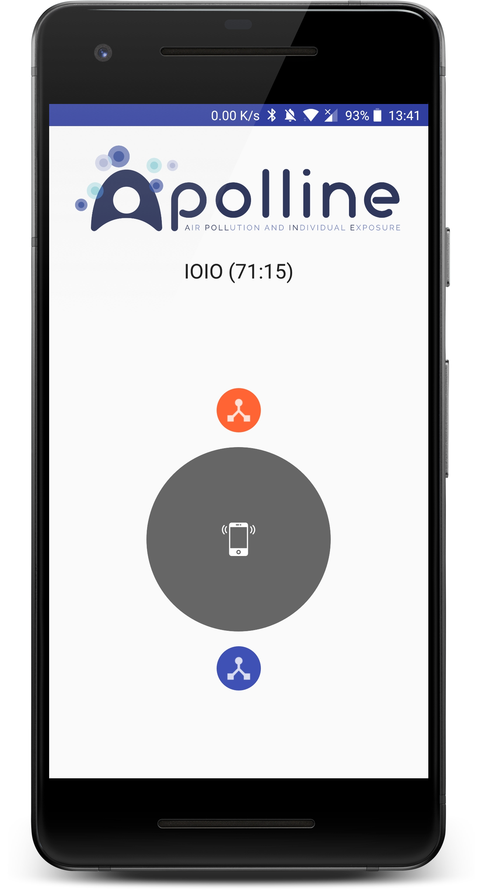

Aymanee

# Apolline-android
Android application for collecting air measurements.

Supported sensors:

 - [LOA](http://www-loa.univ-lille1.fr/) sensor.

## Screenshots
| | | |
|:-------------------------:|:-------------------------:|:-------------------------:|
||||

## Libraries used
 * [IOIO Android Library](https://github.com/ytai/ioio) - The IOIO is a board that provides a host machine the capability of interfacing with external hardware over a variety of commonly used protocols.
 * [Android Architecture Components View Model](https://developer.android.com/topic/libraries/architecture/viewmodel.html) - Lifecycle aware view model.
 * [RxJava](https://github.com/ReactiveX/RxJava) - Asynchronous programming with observable streams.
 * [Retrofit](http://square.github.io/retrofit/) - HTTP client.
 * [Android Priority Job Queue](https://github.com/yigit/android-priority-jobqueue) - Priority Job Queue is an implementation of a Job Queue specifically written for Android to easily schedule jobs (tasks) that run in the background, improving UX and application stability.
 * [Kodein](https://salomonbrys.github.io/Kodein/) - Kotlin Dependency Injection.
 * [Anko](https://github.com/Kotlin/anko) - Anko is a Kotlin library which makes Android application development faster and easier.
 * [MPAndroidChart](https://github.com/PhilJay/MPAndroidChart) - MPAndroidChart is a powerful & easy to use chart library for Android. It runs on API level 8 and upwards.
 * [Room](https://developer.android.com/topic/libraries/architecture/room.html) - The Room persistence library provides an abstraction layer over SQLite to allow fluent database access while harnessing the full power of SQLite.
 * [OpenCSV](opencsv.sourceforge.net) - General. opencsv is an easy-to-use CSV (comma-separated values) parser library for Java.
 * [Android Reactive Location](https://github.com/mcharmas/Android-ReactiveLocation) - Small library that wraps Google Play Services API in brilliant RxJava Observables reducing boilerplate to minimum.
 * [GeoHash](https://github.com/kungfoo/geohash-java) - Implementation of GeoHashes in java.
 * [KPermissionsons](https://github.com/Fondesa/KPermissions) - An Android library totally written in Kotlin that helps to request runtime permissions. 
 * [LeakCanary](https://github.com/square/leakcanary) - A memory leak detection library for Android and Java.
 * [CrashLytics](https://try.crashlytics.com/) - Crash reporting solution.
 * [Firebase](https://firebase.google.com/docs/crash/) - Crash Reporting and performance solution.
 * [FloatingActionButton](https://github.com/Clans/FloatingActionButton) - Yet another implementation of Floating Action Button for Android with lots of features.
 * [Circle-Progress-View](https://github.com/jakob-grabner/Circle-Progress-View) - An animated circle view.
 * [Toasty](https://github.com/GrenderG/Toasty) - The usual Android Toast, but with steroids (Colors).
 * [Gson](https://github.com/google/gson) - A Java serialization/deserialization library to convert Java Objects into JSON and back.
 * [Google Maps Android Heatmap Utility](https://developers.google.com/maps/documentation/android-api/utility/heatmap) - The Google Maps Android API Utility Library includes a heatmap utility, which you can use to add one or more heatmaps to a Google map in your application.
 * [Sonar-kotlin](https://github.com/arturbosch/sonar-kotlin) - Kotlin Sonarqube plugin (Unofficial)
 * [Detekt](https://github.com/arturbosch/detekt) - Kotlin static code analysis tool. It operates on the abstract syntax tree provided by the Kotlin compiler.
 * [JaCoCo](http://www.eclemma.org/jacoco/) - JaCoCo is a free code coverage library for Java, which has been created by the EclEmma team based on the lessons learned from using and integration existing libraries for many years.
 * [SeekBarPreference](https://github.com/x1306e6d/SeekBarPreference) - SeekBarPreference is an android library to help using preference with SeekBar.
 * [RxBluetooth](https://github.com/IvBaranov/RxBluetooth) - Android reactive bluetooth library. Basically, RxBluetooth is just wrapper around android BluetoothAdapter.
 * [Android-CircleMenu](https://github.com/szugyi/Android-CircleMenu) - Simple implementation of a circle menu for Android applications.
 * [Android Ripple Background](https://github.com/skyfishjy/android-ripple-background) - A beautiful ripple animation. Gives ability to easily change its color, speed of wave, one ripple or multiple ripples.
 * [Fastlane](https://github.com/fastlane/fastlane) - Fastlane is a tool for iOS and Android developers to automate tedious tasks like generating screenshots, dealing with provisioning profiles, and releasing your application.
 * [GitFlow](http://nvie.com/posts/a-successful-git-branching-model/) - Gitflow Workflow is a Git workflow design that was first published and made popular by Vincent Driessen at nvie.
## Download (Unreleased)

# Contributors

Alphabetical order of last names

* Moncef AOUDIA
* Patrick BINCHTA
* Cyril Delegove
* Guillaume Jean-Jaques SEM
* Damien TOULOUSE
 
 
 
 
 
 
 
 
 
 
 
